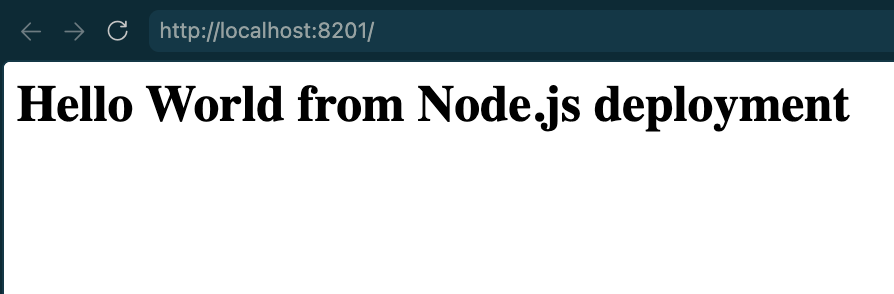
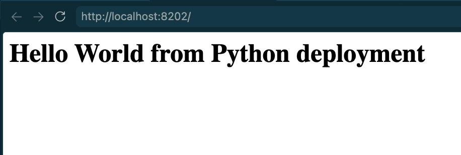
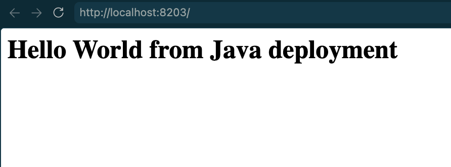

# Dockerfiles and Images

## Run All

```bash
docker compose up -d --build
docker compose ps
```

| App | URL |
| --- | --- |
| Multi-stage | http://localhost:8080 |
| Node.js | http://localhost:8201 |
| Python | http://localhost:8202 |
| Java | http://localhost:8203 |

Stop all apps:

```bash
docker compose down
```

## Deployment Evidence






