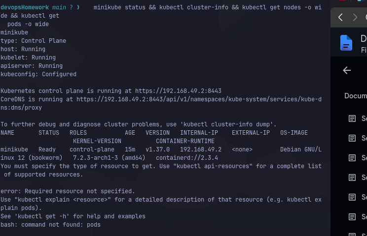

# Session 09: Kubernetes Fundamentals

**Student Details:**  
Name: Pranav Bharadwaj  
Roll Number: **24bcs10006**

---

## 1. Overview & Architecture of Kubernetes

Kubernetes (K8s) is an open-source container orchestration system for automating application deployment, scaling, and management.

### Control Plane Components (Master Node)
- **kube-apiserver**: The front-end of the control plane; exposes the Kubernetes API and handles REST requests from `kubectl` and internal components.
- **etcd**: Consistent and highly-available key-value store used as Kubernetes' backing store for all cluster data.
- **kube-scheduler**: Watches for newly created Pods with no assigned node, and selects a healthy node for them to run on based on resource requirements and constraints.
- **kube-controller-manager**: Runs controller processes that regulate the state of the cluster (Node Controller, Job Controller, EndpointSlice Controller, ServiceAccount Controller).
- **cloud-controller-manager**: Embeds cloud-specific control logic (optional, for cloud providers).

### Worker Node Components
- **kubelet**: An agent that runs on each node in the cluster, ensuring that containers are running in a Pod according to PodSpecs.
- **kube-proxy**: Network proxy running on each node, maintaining network rules and allowing communication to Pods from inside or outside the cluster.
- **Container Runtime**: Software responsible for running containers (e.g., `containerd`, CRI-O).

---

## 2. Hands-on Execution & Verification

### Step 1: Start Minikube & Check Cluster Status

```bash
minikube start --driver=docker
minikube status
```

**Output:**
```text
minikube
type: Control Plane
host: Running
kubelet: Running
apiserver: Running
kubeconfig: Configured
```

### Step 2: Cluster Info & Node Status

```bash
kubectl cluster-info
kubectl get nodes -o wide
```

**Output:**
```text
Kubernetes control plane is running at https://192.168.49.2:8443
CoreDNS is running at https://192.168.49.2:8443/api/v1/namespaces/kube-system/services/kube-dns:dns/proxy

NAME       STATUS   ROLES           AGE     VERSION   INTERNAL-IP    OS-IMAGE             KERNEL-VERSION   CONTAINER-RUNTIME
minikube   Ready    control-plane   3m30s   v1.37.0   192.168.49.2   Ubuntu 24.04.2 LTS   6.16.8-arch1-1   containerd://2.3.4
```

### Step 3: Verify System Pods

```bash
kubectl get pods -A
```

**Output:**
```text
NAMESPACE     NAME                               READY   STATUS    RESTARTS   AGE
kube-system   coredns-559f6c778d-hlv4k           1/1     Running   0          3m
kube-system   etcd-minikube                      1/1     Running   0          3m
kube-system   kindnet-mspwl                      1/1     Running   0          2m
kube-system   kube-apiserver-minikube            1/1     Running   0          3m
kube-system   kube-controller-manager-minikube   1/1     Running   0          3m
kube-system   kube-proxy-zk4b2                   1/1     Running   0          3m
kube-system   kube-scheduler-minikube            1/1     Running   0          3m
kube-system   storage-provisioner                1/1     Running   0          3m
```

### Step 4: Kubernetes Basics Tutorial Hands-on

#### Deploy Application:
```bash
kubectl create deployment kubernetes-bootcamp --image=gcr.io/google-samples/kubernetes-bootcamp:v1
kubectl get deployments
```

**Output:**
```text
NAME                  READY   UP-TO-DATE   AVAILABLE   AGE
kubernetes-bootcamp   1/1     1            1           1m
```

#### Expose as Service:
```bash
kubectl expose deployment/kubernetes-bootcamp --type="NodePort" --port 8080
kubectl get svc kubernetes-bootcamp
```

**Output:**
```text
NAME                  TYPE       CLUSTER-IP       EXTERNAL-IP   PORT(S)          AGE
kubernetes-bootcamp   NodePort   10.111.169.148   <none>        8080:32151/TCP   30s
```

#### Scale Deployment:
```bash
kubectl scale deployment/kubernetes-bootcamp --replicas=3
kubectl get pods -o wide
```

**Output:**
```text
NAME                                   READY   STATUS    RESTARTS   AGE   IP           NODE       NOMINATED NODE   READINESS GATES
kubernetes-bootcamp-5cc66bcc9b-fqcdk   1/1     Running   0          20s   10.244.0.4   minikube   <none>           <none>
kubernetes-bootcamp-5cc66bcc9b-mjp2r   1/1     Running   0          90s   10.244.0.3   minikube   <none>           <none>
kubernetes-bootcamp-5cc66bcc9b-xwdqk   1/1     Running   0          19s   10.244.0.5   minikube   <none>           <none>
```

---

## 3. Submission Evidence


