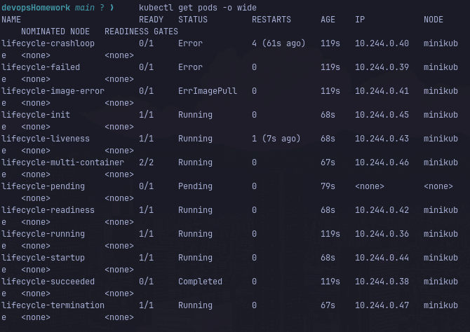

# Session 10: Kubernetes Pods, ReplicaSets & Deployments

**Student Details:**  
Name: Pranav Bharadwaj  
Roll Number: **24bcs10006**

---

## Task 1: Kubernetes Deployment Strategies

In Kubernetes, deployment strategies define how application pods are created, updated, and rolled back. All four major deployment strategies were implemented, deployed, and verified on the cluster.

---

### 1. Rolling Update (Default Strategy)
Gradually replaces instances of previous versions with new versions without downtime.

- **Configuration:** `maxSurge: 1`, `maxUnavailable: 0`
- **Manifests:** `01-rolling-update/deployment-v1.yaml`, `01-rolling-update/deployment-v2.yaml`, `01-rolling-update/service.yaml`
- **Key Commands:**
  ```bash
  kubectl apply -f 01-rolling-update/deployment-v1.yaml -f 01-rolling-update/service.yaml
  kubectl rollout status deployment/app-rolling
  kubectl apply -f 01-rolling-update/deployment-v2.yaml
  kubectl rollout status deployment/app-rolling
  ```
- **Observed Behavior:** Kubernetes spun up v2 replicas, verified readiness probes, and only terminated v1 pods after v2 pods were ready. Service capacity never dropped below desired 4 replicas.

---

### 2. Blue-Green Deployment
Maintains two separate environments: Blue (current live version) and Green (new version). Once Green is fully healthy and verified, traffic is instantly switched by updating the Service selector.

- **Manifests:** `02-blue-green/deployment-blue.yaml`, `02-blue-green/deployment-green.yaml`, `02-blue-green/service-blue.yaml`, `02-blue-green/service-green.yaml`
- **Key Commands:**
  ```bash
  kubectl apply -f 02-blue-green/deployment-blue.yaml -f 02-blue-green/service-blue.yaml
  kubectl apply -f 02-blue-green/deployment-green.yaml
  # Switch traffic to Green:
  kubectl apply -f 02-blue-green/service-green.yaml
  ```
- **Observed Behavior:** Zero downtime cutover with instant rollback capability if an issue is discovered in Green.

---

### 3. Canary Deployment
Routes a small percentage of production traffic to a new version (canary) alongside the stable version to validate behavior under real traffic before full release.

- **Traffic Split:** 90% Stable (9 pods) / 10% Canary (1 pod) via single service selector `app: myapp-canary`
- **Manifests:** `03-canary/deployment-stable.yaml`, `03-canary/deployment-canary.yaml`, `03-canary/service.yaml`
- **Key Commands:**
  ```bash
  kubectl apply -f 03-canary/deployment-stable.yaml -f 03-canary/deployment-canary.yaml -f 03-canary/service.yaml
  kubectl get pods -l app=myapp-canary -L track -L version
  ```
- **Observed Behavior:** 9 stable pods and 1 canary pod concurrently handled incoming requests proportionally.

---

### 4. Recreate Deployment
All existing pods are terminated before new pods are created. Useful when two versions cannot run concurrently (e.g. database schema lock).

- **Configuration:** `strategy.type: Recreate`
- **Manifests:** `04-recreate/deployment-v1.yaml`, `04-recreate/deployment-v2.yaml`, `04-recreate/service.yaml`
- **Key Commands:**
  ```bash
  kubectl apply -f 04-recreate/deployment-v1.yaml -f 04-recreate/service.yaml
  kubectl apply -f 04-recreate/deployment-v2.yaml
  ```
- **Observed Behavior:** All v1 pods showed `Terminating` simultaneously, and only after termination were v2 pods scheduled and created.

---

## Task 2: Kubernetes Pod Lifecycle Demonstration

Demonstrated every lifecycle state and probe mechanism in Kubernetes:

| Pod Name | Observed Status | Reason / Explanation |
| :--- | :--- | :--- |
| `lifecycle-running` | **Running** (1/1) | Pod scheduled, image pulled, container started successfully. |
| `lifecycle-pending` | **Pending** (0/1) | Requested 100Gi memory; exceeds node allocatable memory, scheduler keeps pod in Pending. |
| `lifecycle-succeeded` | **Completed** (0/1) | Container ran `exit 0` with `restartPolicy: OnFailure`, terminating normally. |
| `lifecycle-failed` | **Error** (0/1) | Container ran `exit 1` with `restartPolicy: Never`, terminated abnormally. |
| `lifecycle-crashloop` | **CrashLoopBackOff** | Container exits with error and `restartPolicy: Always`; kubelet repeatedly restarts with exponential backoff. |
| `lifecycle-image-error`| **ImagePullBackOff** | Pod uses nonexistent image `jakwehrgkaejw:kahsdfgkhj`; kubelet cannot pull image. |
| `lifecycle-readiness` | **Running** (1/1) | Passed HTTP readiness probe; marked ready to receive traffic. |
| `lifecycle-liveness` | **Running** (1/1) | Liveness probe checks container health; restarts container if probe fails. |
| `lifecycle-startup` | **Running** (1/1) | Startup probe protects slow-starting containers before liveness probe begins. |
| `lifecycle-init` | **Running** (1/1) | Init container executed and completed first before app container started. |
| `lifecycle-multi-container`| **Running** (2/2) | Two containers (app + sidecar) running in the same Pod sharing network/volumes. |
| `lifecycle-termination`| **Running** (1/1) | Configured with `terminationGracePeriodSeconds: 30` and preStop hook for graceful shutdown. |

---

## Cluster Verification Output

```text
$ kubectl get pods -o wide
NAME                        READY   STATUS             RESTARTS      AGE   IP            NODE       NOMINATED NODE   READINESS GATES
lifecycle-crashloop         0/1     Error              3 (51s ago)   76s   10.244.0.39   minikube   <none>           <none>
lifecycle-failed            0/1     Error              0             76s   10.244.0.38   minikube   <none>           <none>
lifecycle-image-error       0/1     ImagePullBackOff   0             76s   10.244.0.40   minikube   <none>           <none>
lifecycle-init              1/1     Running            0             25s   10.244.0.44   minikube   <none>           <none>
lifecycle-liveness          1/1     Running            0             25s   10.244.0.42   minikube   <none>           <none>
lifecycle-multi-container   2/2     Running            0             24s   10.244.0.45   minikube   <none>           <none>
lifecycle-pending           0/1     Pending            0             36s   <none>        <none>     <none>           <none>
lifecycle-readiness         1/1     Running            0             25s   10.244.0.41   minikube   <none>           <none>
lifecycle-running           1/1     Running            0             76s   10.244.0.36   minikube   <none>           <none>
lifecycle-startup           0/1     Running            0             25s   10.244.0.43   minikube   <none>           <none>
lifecycle-succeeded         0/1     Completed          0             76s   10.244.0.37   minikube   <none>           <none>
lifecycle-termination       1/1     Running            0             24s   10.244.0.46   minikube   <none>           <none>
```

---

## Submission Evidence


