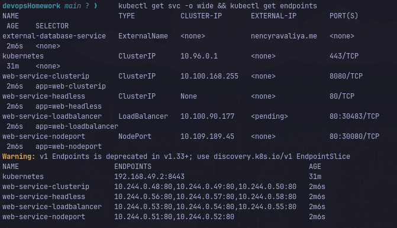

# Session 11: Kubernetes Networking & Services

**Student Details:**  
Name: Pranav Bharadwaj  
Roll Number: **24bcs10006**

---

## Task 1: Kubernetes Service Types Demonstration

All 5 Kubernetes Service types were deployed and tested on the cluster:

| Service Type | Service Name | Cluster-IP / Details | Target | Connectivity Test Result |
| :--- | :--- | :--- | :--- | :--- |
| **ClusterIP** | `web-service-clusterip` | `10.100.168.255:8080` | `web-app-clusterip` (3 pods) | `HTTP/1.1 200 OK` via in-cluster curl |
| **NodePort** | `web-service-nodeport` | `10.109.189.45:80`, NodePort `30080` | `web-app-nodeport` (2 pods) | `HTTP/1.1 200 OK` via `http://<node-ip>:30080` |
| **LoadBalancer** | `web-service-loadbalancer` | `10.100.90.177:80`, NodePort `30483` | `web-app-loadbalancer` (3 pods) | Provisioned and routed across 3 backend endpoints |
| **ExternalName** | `external-database-service` | External CNAME: `nencyravaliya.me` | External endpoint | CNAME DNS alias mapped via CoreDNS |
| **Headless** | `web-service-headless` | `ClusterIP: None` | `web-stateful` (3 pods) | Direct DNS A records returned for each pod IP |

---

## Task 2: Kubernetes Object Comparisons

### 1. Deployment vs ReplicaSet

| Feature | ReplicaSet | Deployment |
| :--- | :--- | :--- |
| **Purpose** | Guarantees that a specified number of identical pod replicas are running at all times. | High-level declarative controller that manages ReplicaSets and provides declarative updates. |
| **Pod Management** | Creates and deletes pods based on label selector and replica count. | Manages underlying ReplicaSets; does not manipulate individual pods directly. |
| **Scaling** | Supports imperative and declarative scaling (`spec.replicas`). | Scales pods seamlessly by updating `spec.replicas` on the target ReplicaSet. |
| **Rolling Updates** | **No native support.** Updating pod template does not replace already-running pods. | **Full native support.** Creates a new ReplicaSet, scales it up, and scales down the old one. |
| **Rollbacks & History** | None. Manual intervention required. | Native rollbacks (`kubectl rollout undo`) with revision history tracking. |
| **Relationship** | Subordinate object managed by Deployment. | Higher-level abstraction; users should almost always create Deployments. |

---

### 2. Deployment vs DaemonSet vs StatefulSet

| Dimension | Deployment | DaemonSet | StatefulSet |
| :--- | :--- | :--- | :--- |
| **Primary Use Case** | Stateless microservices (web frontends, REST APIs). | Node-level background agents (logging, monitoring, CNI). | Stateful applications (databases, message brokers like Kafka, Redis, PostgreSQL). |
| **Pod Creation & Identity** | Random pod names (e.g. `web-app-66865d-kxmkf`), interchangeable instances. | One pod per matched node (e.g. `fluentd-node1`), runs automatically on new nodes. | Deterministic, ordered names (`web-stateful-0`, `1`, `2`), stable persistent network identity. |
| **Scaling Behavior** | Pods created/terminated concurrently in arbitrary order. | Controlled by cluster node additions and deletions. | Strict ordered creation (`0` -> `1` -> `2`) and ordered termination (`2` -> `1` -> `0`). |
| **Networking** | Shared ClusterIP / load balanced across identical replicas. | HostPort or NodePort for node-level communication. | Headless Service (`clusterIP: None`) provides individual DNS record per pod. |
| **Storage** | Ephemeral or shared volume (PersistentVolumeClaim shared). | Typically `hostPath` to inspect node files (`/var/log`, `/proc`). | Dedicated `volumeClaimTemplates` creating distinct PersistentVolumes per ordinal replica. |
| **Examples** | Nginx, Node.js API, Spring Boot microservice. | Prometheus Node Exporter, Fluentbit, Calico CNI agent. | MongoDB replica set, Apache Kafka, Elasticsearch cluster. |

---

### 3. ReplicaSet vs Service

| Dimension | ReplicaSet | Service |
| :--- | :--- | :--- |
| **Core Responsibility** | **Workload Availability & Quantity**: Ensures `N` copies of a Pod are running. | **Networking & Access**: Provides a stable IP, DNS name, and load balancing. |
| **Why Service is Required** | Pods are ephemeral; their IP addresses change every time they are restarted or rescheduled. A ReplicaSet cannot provide a stable entry point for consumers. | A Service assigns a fixed virtual IP (ClusterIP) and forwards traffic to whichever healthy pods match the label selector. |
| **How Traffic Reaches Pods** | Does not handle networking or traffic routing. | `kube-proxy` monitors Services and Endpoints, updating `iptables` or IPVS rules on every node to route requests to healthy Pod IPs. |

---

## Task 3 & 4: FQDN & CoreDNS Documentation

- Detailed FQDN guide: [fqdn/README.md](fqdn/README.md)
- Detailed CoreDNS guide: [coredns/README.md](coredns/README.md)

---

## Verification Commands & Outputs

```text
$ kubectl get svc -o wide
NAME                        TYPE           CLUSTER-IP       EXTERNAL-IP        PORT(S)        AGE   SELECTOR
external-database-service   ExternalName   <none>           nencyravaliya.me   <none>         8s    <none>
kubernetes                  ClusterIP      10.96.0.1        <none>             443/TCP        29m   <none>
web-service-clusterip       ClusterIP      10.100.168.255   <none>             8080/TCP       8s    app=web-clusterip
web-service-headless        ClusterIP      None             <none>             80/TCP         8s    app=web-headless
web-service-loadbalancer    LoadBalancer   10.100.90.177    <pending>          80:30483/TCP   8s    app=web-loadbalancer
web-service-nodeport        NodePort       10.109.189.45    <none>             80:30080/TCP   8s    app=web-nodeport

$ kubectl get endpoints
NAME                       ENDPOINTS                                      AGE
kubernetes                 192.168.49.2:8443                              29m
web-service-clusterip      10.244.0.48:80,10.244.0.49:80,10.244.0.50:80   16s
web-service-headless       10.244.0.56:80,10.244.0.57:80,10.244.0.58:80   16s
web-service-loadbalancer   10.244.0.53:80,10.244.0.54:80,10.244.0.55:80   16s
web-service-nodeport       10.244.0.51:80,10.244.0.52:80                  16s

$ curl -s -I http://$(minikube ip):30080
HTTP/1.1 200 OK
Server: nginx/1.25.5
```

---

## Submission Evidence



## Fresh local verification — 7 October 2026

The five existing Service manifests were deployed in a separate `session11` namespace on Minikube. The current manifests use `nginx:1.27-alpine` and BusyBox test Pods, because Docker Hub limited anonymous pulls of the older image tags; the earlier teaching examples and screenshot above are historical. Every workload Pod was Ready: ClusterIP 3/3, NodePort 2/2, LoadBalancer 3/3 and headless StatefulSet 3/3.

Reproduce from the repository root after starting Minikube and loading the required images:

```sh
kubectl create namespace session11
kubectl apply -n session11 -f 10-kubernetes-services/01-clusterip/app-deployment.yaml -f 10-kubernetes-services/01-clusterip/service.yaml -f 10-kubernetes-services/01-clusterip/client-pod.yaml
kubectl apply -n session11 -f 10-kubernetes-services/02-nodeport/app-deployment.yaml -f 10-kubernetes-services/02-nodeport/service.yaml
kubectl apply -n session11 -f 10-kubernetes-services/03-loadbalancer/app-deployment.yaml -f 10-kubernetes-services/03-loadbalancer/service.yaml
kubectl apply -n session11 -f 10-kubernetes-services/04-externalname/service.yaml -f 10-kubernetes-services/04-externalname/client-pod.yaml
kubectl apply -n session11 -f 10-kubernetes-services/05-headless/service.yaml -f 10-kubernetes-services/05-headless/app-statefulset.yaml -f 10-kubernetes-services/05-headless/client-pod.yaml
kubectl get pods,deployments,statefulsets,svc -n session11 -o wide
kubectl get endpoints -n session11
```

```text
$ kubectl get svc -n session11 -o wide
NAME                        TYPE           CLUSTER-IP      EXTERNAL-IP        PORT(S)
external-database-service   ExternalName   <none>          nencyravaliya.me   <none>
web-service-clusterip       ClusterIP      10.97.83.33     <none>             8080/TCP
web-service-headless        ClusterIP      None            <none>             80/TCP
web-service-loadbalancer    LoadBalancer   10.97.62.223    10.97.62.223       80:30309/TCP
web-service-nodeport        NodePort       10.106.47.23    <none>             80:30080/TCP

$ kubectl get endpoints -n session11
web-service-clusterip      10.244.0.20:80,10.244.0.21:80,10.244.0.22:80
web-service-headless       10.244.0.31:80,10.244.0.32:80,10.244.0.33:80
web-service-loadbalancer   10.244.0.26:80,10.244.0.27:80,10.244.0.28:80
web-service-nodeport       10.244.0.24:80,10.244.0.25:80
```

Actual connectivity checks:

| Type | Command | Observed result |
|---|---|---|
| ClusterIP | `kubectl exec -n session11 curl-client -- wget -qO- http://web-service-clusterip:8080/` | Nginx welcome HTML |
| NodePort | `curl -fsS http://192.168.49.2:30080/` | Nginx welcome HTML from host |
| LoadBalancer | `kubectl exec -n session11 curl-client -- wget -qO- http://web-service-loadbalancer/` | Nginx welcome HTML |
| LoadBalancer external | With `minikube tunnel` running: `curl -fsS http://10.97.62.223/` | Nginx welcome HTML from host; tunnel then stopped |
| ExternalName | `kubectl exec -n session11 dns-test-client -- nslookup external-database-service.session11.svc.cluster.local` | `canonical name = nencyravaliya.me` |
| Headless | `kubectl exec -n session11 headless-dns-client -- nslookup web-service-headless.session11.svc.cluster.local` | Three Pod IPs: `.31`, `.32`, `.33` |
| Headless per Pod | `kubectl exec -n session11 headless-dns-client -- wget -qO- http://web-stateful-0.web-service-headless.session11.svc.cluster.local/` | Nginx welcome HTML |

The external alias DNS test confirms the Kubernetes CNAME, but it does not prove reachability of the external website. The historical screenshot remains linked above; the fresh command output here is the Session 11 output deliverable. `minikube tunnel` required a local sudo password to install its temporary route and was stopped after verification.
