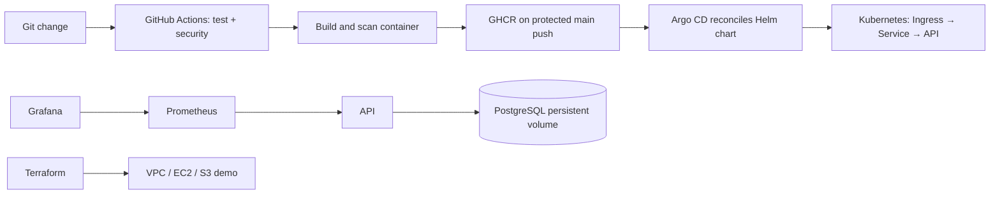

# DevOps Homework — Pranav Bharadwaj (24bcs10006)

Course exercises from Linux and shell scripting through a final DevOps project. Each session directory contains practical notes and commands. Text output in existing notes is student-provided historical evidence; it is not a claim that those services are currently running. See [PROGRESS.md](PROGRESS.md) for requirement status and environment limits.

## Final project overview

The final project is a small Python HTTP API with optional PostgreSQL visit persistence, a non-root container, Compose, Kubernetes resources, a Helm chart, CI/security gates, Terraform examples, Prometheus scrape configuration, Grafana datasource provisioning, and Argo CD desired state.



The AWS Terraform project is a separate cloud learning demo. It does not provision an EKS cluster. GitOps and monitoring manifests are examples until installed on a real cluster.

## Repository map

| Session | Path |
|---|---|
| 01 Linux fundamentals | `01-linux-fundamentals/` |
| 02 Shell scripting | `02-shell-scripting/system-information-script/` |
| 03 Networking | `03-networking-fundamentals/command-practice/` |
| 04 Git and GitHub | `04-git-github/` |
| 05 Docker fundamentals (Node, Python, Java, Apache, React, Nginx) | `05-docker-fundamentals/` |
| 06 Dockerfiles and multi-stage images | `06-dockerfiles-images/` |
| 07 Docker networking and volumes | `07-docker-networking-volumes/` |
| 09 Kubernetes fundamentals | `08-kubernetes-fundamentals/` |
| 10 Pods, deployments and strategies | `09-kubernetes-pods-deployments/` |
| 11 Kubernetes Services, DNS | `10-kubernetes-services/` |
| 12 Ingress, ConfigMaps and Secrets | `12-kubernetes-config-ingress/` |
| 13 Storage and HPA | `13-kubernetes-storage-hpa/` |
| 14 Troubleshooting | `14-kubernetes-troubleshooting/` |
| 15 Helm | `15-helm/` |
| 16 CI/CD | `16-cicd/` |
| 17 DevSecOps | `17-devsecops/` |
| 18 Terraform and AWS services | `18-terraform-infrastructure/` (links to `terraform-s3-demo/` and `aws-services/`) |
| 18 AWS services | `aws-services/` |
| 19 Terraform architecture | `19-cloud-terraform/` (links to `terraform-cloud/`) |
| 20 Monitoring and GitOps | `20-monitoring-gitops/` |
| 21 Final project | `final-devops-project/` |

## Local application and tests

Requires Python 3.12. Unit tests use only the standard library. For database persistence, Compose requires Docker Engine and `DB_PASSWORD`:

```sh
python -m unittest discover -s final-devops-project/application -p 'test_*.py' -v
python final-devops-project/application/app.py
curl http://localhost:8000/
curl http://localhost:8000/health
curl http://localhost:8000/metrics

export DB_PASSWORD='choose-a-local-password'
docker compose -f final-devops-project/docker/compose.yaml up --build -d
docker compose -f final-devops-project/docker/compose.yaml ps
curl http://localhost:8000/
docker compose -f final-devops-project/docker/compose.yaml down
unset DB_PASSWORD
```

API: `GET /` and `/api`, `GET /health`, and `GET /metrics`; unknown paths return 404. The database is optional in direct Python mode; in Compose each root request records a visit in PostgreSQL.

## Docker exercises

The six Session 05 images are independently buildable under their named folders and can be started using `docker compose -f 05-docker-fundamentals/docker-compose.yml up --build -d`. Session 06 provides Node, Python and Java examples plus a multi-stage build. Session 07 has separate network, host-network, bind-mount and overlay labs. Docker execution requires an active local daemon.

## Kubernetes and Helm

Final app manifests are in `final-devops-project/kubernetes/`: ConfigMap, Secret reference, API Deployment, PostgreSQL StatefulSet with claim, Services, Ingress, HPA and load generator. Create the database Secret locally before deployment; never commit real values. The base manifest uses `latest` for manual demos; the Helm chart receives an immutable commit tag from CI after publishing. A cluster, ingress controller, default StorageClass and metrics-server are needed. See `12-kubernetes-config-ingress/README.md` for Secret creation.

```sh
helm lint final-devops-project/helm
helm template homework final-devops-project/helm
kubectl apply -f final-devops-project/kubernetes/postgres.yaml
kubectl apply -f final-devops-project/kubernetes/base.yaml
```

Helm install, upgrade, history, rollback and uninstall practice is in `15-helm/README.md`. `kubectl apply` requires a configured cluster; Helm lint/render can run offline.

## CI/CD and DevSecOps

`.github/workflows/devsecops.yml` runs unit tests, Bandit SAST, pip-audit SCA, Gitleaks secret scan, Docker build and Trivy image scan. A failing gate blocks GHCR publication. On a main push, CI publishes `latest` and a commit-tagged image, then updates the Helm image tag in Git; Argo CD reconciles that desired state. The publish job uses GitHub's short-lived `GITHUB_TOKEN` and needs permission to write to `main`. Push to GitHub to run it; no remote execution is claimed from this checkout.

## Terraform and AWS

`terraform-s3-demo/` creates a private, versioned and encrypted S3 bucket. `terraform-cloud/` demonstrates VPC, subnet, route, security group, EC2 and S3 resources. Both need AWS credentials, provider downloads and plan review. No cloud resource has been created here. Protect Terraform state; never commit tfvars or state files.

## Monitoring and GitOps

The API exports a Prometheus text endpoint. Scrape and datasource examples are in `20-monitoring-gitops/`; Argo CD configuration is in `final-devops-project/gitops/application.yaml`. Install the stacks in a cluster before claiming live metrics, alerts, or Synced/Healthy state. See `20-monitoring-gitops/observability.md`.

## Troubleshooting and evidence

Kubernetes failure cases and commands are documented in `14-kubernetes-troubleshooting/`. Deliberately broken YAML remains isolated in session `troubleshooting/` folders. Do not apply these examples to a production namespace. Historical screenshots are embedded in existing session READMEs. New live evidence still needed is enumerated in [SCREENSHOT_CHECKLIST.md](SCREENSHOT_CHECKLIST.md); no screenshot was fabricated.

## Validation status

- **VERIFIED LOCALLY:** only checks recorded in `PROGRESS.md` after execution.
- **REQUIRES EXTERNAL CREDENTIALS:** AWS plan/apply and GitHub-hosted Actions / GHCR publish.
- **REQUIRES WORKING RUNTIMES:** Docker image/Compose and Kubernetes deploy, HPA, Ingress, Helm rollback, GitOps and monitoring.
- **REQUIRES USER SCREENSHOT:** genuine live evidence listed in `SCREENSHOT_CHECKLIST.md`.
# DevOps_Homework
