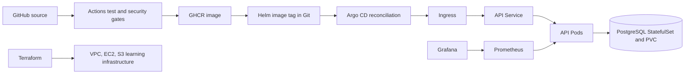

# Final DevOps project

## Project overview

This is the Session 21 application and delivery project. A Python HTTP API returns a greeting, health and Prometheus metrics. PostgreSQL stores a visit row for each root request. A database connection failure returns HTTP 503 and logs a structured error.

## Architecture diagram

The Terraform demo does not provision a Kubernetes cluster; local Minikube is used for Kubernetes verification.

## Technologies used

Python 3.12, PostgreSQL 16, Docker Compose, Kubernetes, Helm 3, GitHub Actions, GHCR, Bandit, pip-audit, Gitleaks, Trivy, Terraform with the AWS provider, Prometheus, Grafana and Argo CD.

| Component | Location |
|---|---|
| Application and unit tests | `application/` |
| Dockerfile and Compose stack | `docker/` |
| Kubernetes Deployment, Service, ConfigMap, Secret reference, Ingress, HPA, StatefulSet and PVC | `kubernetes/` |
| Helm chart with configurable image and database | `helm/` |
| Terraform AWS demo | `terraform/` |
| CI and security pipeline | `.github/workflows/` and `security/` |
| Local Prometheus/Grafana | `monitoring/` |
| Argo CD Application | `gitops/` |
| Isolated failure drills | `troubleshooting/` |

## Application setup

From the repository root, run `python3 -m unittest discover -s final-devops-project/application -p 'test_*.py' -v`, then `python3 final-devops-project/application/app.py`. `GET /` and `GET /api` return a visit JSON object; `GET /health` returns status; `GET /metrics` exports a request counter. The direct Python run has no database URL and reports a null visit ID.

## Docker setup

Set a local `DB_PASSWORD` shell variable, then run `docker compose -f final-devops-project/docker/compose.yaml up -d --build`. The API is on `localhost:8000`; PostgreSQL uses a named data volume. Run `docker compose -f final-devops-project/docker/compose.yaml ps`, request `/`, and query the `visits` table inside the database container to verify persistence. `docker compose ... down` stops only this project; do not use `down -v` unless you intend to erase its database.

## Kubernetes deployment

For a manual deployment, create the `homework-api-secret` with `DB_PASSWORD` and `DATABASE_URL` as described in `../12-kubernetes-config-ingress/README.md`. Apply `kubernetes/postgres.yaml` and `kubernetes/base.yaml` to the same namespace, with the API image updated to a published tag. The API has readiness and liveness probes, CPU/memory requests and limits; PostgreSQL uses a PVC. An Ingress controller, Metrics Server and default StorageClass are required for their respective features. The local Helm deployment described below was verified separately.

## Helm deployment

Run `helm lint final-devops-project/helm` and `helm template homework final-devops-project/helm` offline. In a cluster namespace with the Secret, run `helm upgrade --install homework final-devops-project/helm -n homework`. Configure `image.repository`, `image.tag`, and ingress host for that environment. The local Minikube exercise used a loaded `devops-homework-final-api:latest` image and verified install, two upgrades and rollback; see `../15-helm/README.md` for the command sequence.

## Terraform infrastructure

`terraform/` contains the final project's AWS VPC, public subnet, route, restricted security group, EC2 demo and private S3 bucket. `../terraform-s3-demo/` is the separate Session 18 exercise. Both validate locally. AWS `plan`, `apply`, `show`, `output` and `destroy` require credentials and have not been claimed as executed.

## CI/CD pipeline

The executable workflow is at repository root `../.github/workflows/devsecops.yml`, with a submission copy in `.github/workflows/`. It tests, scans and builds for pushes and pull requests. On a main push with all gates green, it publishes the image to GHCR and commits the SHA image tag into the Helm values. The [hosted run on 8 October 2026](https://github.com/pranav7796/devopsHomework/actions/runs/37801718339) passed both `test-and-security` and `publish`; [screenshot evidence](evidence/github-actions.png) is included.

## DevSecOps implementation

Bandit scans Python source, pip-audit checks pinned Python dependencies, Gitleaks scans for secrets, and Trivy checks the built image. Each gate returns a failing exit status for findings; image publication depends on all gates. The workflow uses GitHub's token for GHCR and repository updates, and no real credentials are committed. Details: `security/README.md`.

## Monitoring

The API exposes `/metrics` and structured request logs. `monitoring/` runs Prometheus, Grafana and node-exporter against the local API stack, with an API-down alert rule and CPU/memory host metrics. This stack requires Docker images to be pulled. The separate `../20-monitoring-gitops/` directory has Kubernetes scrape and observability notes.

## GitOps

`gitops/application.yaml` declares the main Argo CD Application watching this chart on GitHub; the main-branch CI job advances its image tag in Git. `gitops/application-local.yaml` verifies chart reconciliation with a locally built image; the [Argo CD screenshot](evidence/argocd-sync.png) shows it Synced and Healthy with two Ready API Pods and one Ready database Pod. `gitops/application-registry.yaml` verifies the CI-to-registry path in a separate Minikube namespace, using the chart's published GHCR image tag without an image override. After repairing the Minikube node's DNS, Argo CD reported this registry Application Synced and Healthy at revision `12d98f1`; the published image ran in both API Pods, and a request through its Service wrote visit ID 1 to PostgreSQL. The API Service selects only API Pods; the database has its own Service. Neither local Application provisions AWS infrastructure.

## Troubleshooting

`troubleshooting/` contains isolated broken-image and bad-selector drills with symptoms, investigation, root cause, fix and observed verification. Both issues were reproduced and repaired in `homework-drill`; the healthy Helm chart does not include these files. See the [troubleshooting record](troubleshooting/README.md).

## Screenshots and evidence

The [GitHub Actions](evidence/github-actions.png) and [Argo CD](evidence/argocd-sync.png) screenshots document the final-project pipeline and local GitOps deployment. The [monitoring screenshot](../20-monitoring-gitops/evidence/monitoring-grafana.png) and earlier session evidence are linked from their READMEs. The remaining AWS screenshot is listed in `../SCREENSHOT_CHECKLIST.md`. Actual local checks and external work are recorded in `../PROGRESS.md`.

## Lessons learned

An image can build while the cluster still cannot pull it; loading exact images into Minikube solved the local registry/DNS issue. A persistent claim and application readiness are separate checks: a Ready API is not proof of database writes, so both an API request and SQL count were checked. Keep failure drills outside the healthy namespace.
